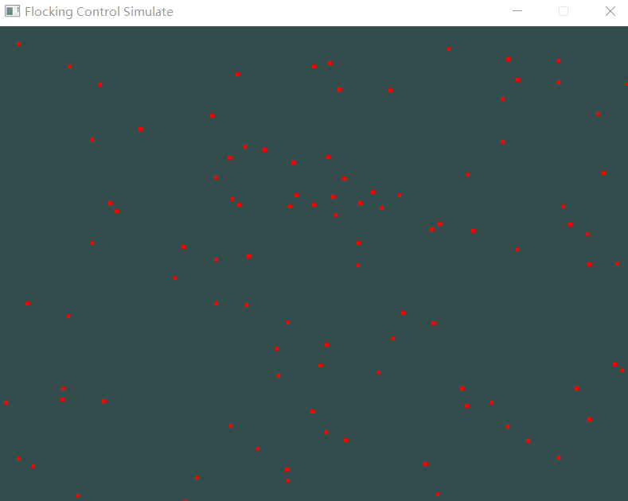
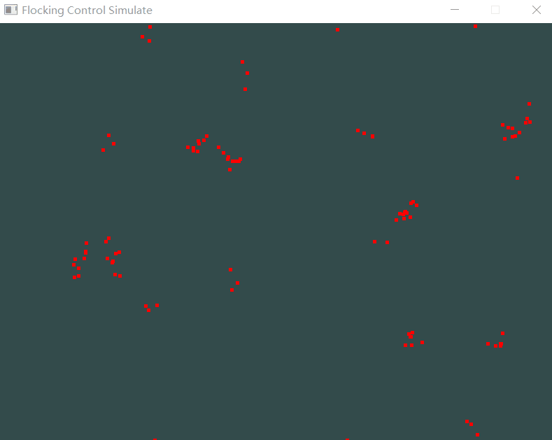
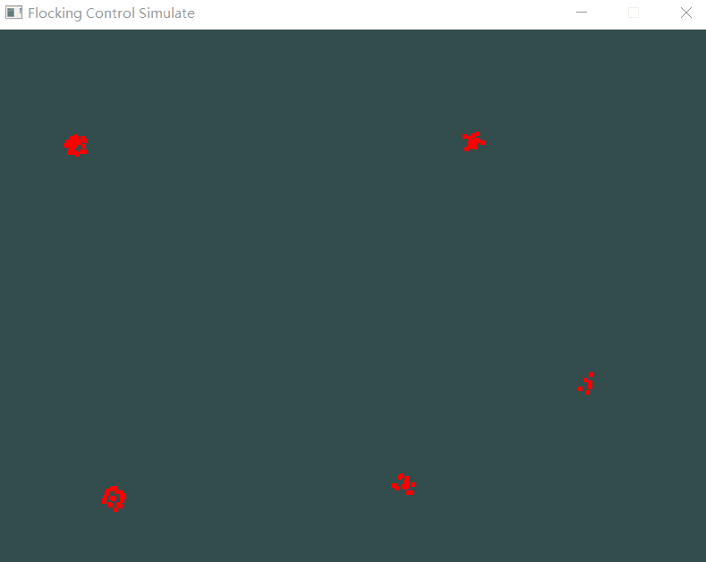
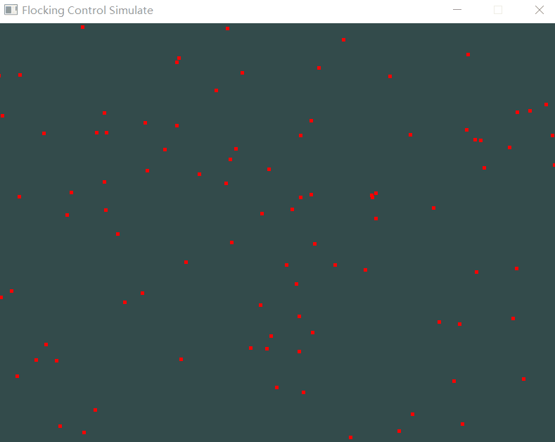
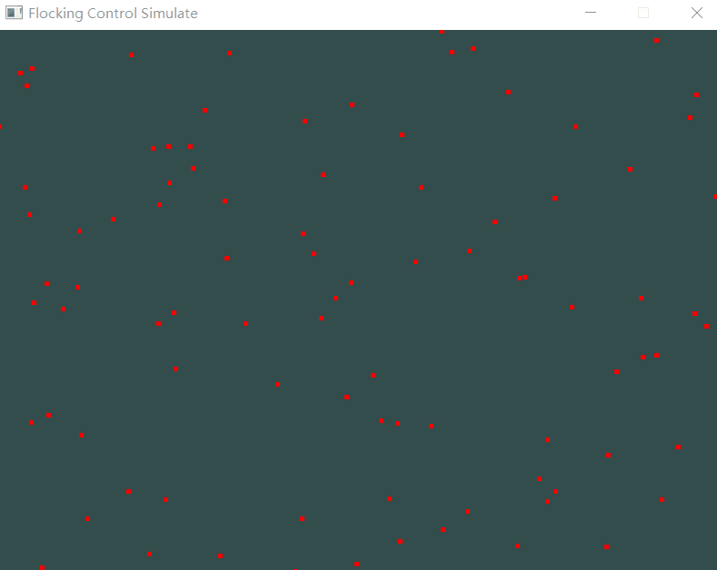

# Boids
使用C++、OpenGL、Eigen模拟实现了Boids算法
主要参考了一位大佬的p5.js代码，用C++进行重写
* 大佬主页：[https://www.youtube.com/user/shiffman](https://www.youtube.com/user/shiffman)
* 大佬源码：[https://editor.p5js.org/codingtrain/sketches/ry4XZ8OkN](https://editor.p5js.org/codingtrain/sketches/ry4XZ8OkN)
---
boids算法原理 :[https://www.red3d.com/cwr/boids/](https://www.red3d.com/cwr/boids/)

---

## 运行效果：
* 初始状态：无序运动（Nocontrol）

* 按<kbd>A</kbd>，添加Alignment

* 按<kbd>S</kbd>，添加Separation

* 按<kbd>C</kbd>，添加Cohesion

* 按<kbd>F</kbd>，添加三种作用

* 其他按键，不添加作用，继续无序运动
